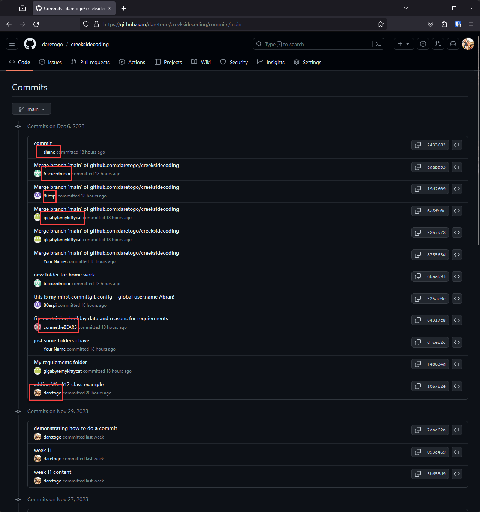

# Week 12 Homework

## Class Review
Great work in class this week guys, I am so proud of you all making your very first commits to our creekside coding github repo. 

Let's go to the github.com website and visit the creekside coding repo

[https://github.com/daretogo/creeksidecoding](https://github.com/daretogo/creeksidecoding) 

be sure that you are signed in (look in the upper right for a sign in button if needed). 

From that page you should see a message that shows the number of commits: 


When you click on that link, you'll be shown a "commit history" which will show you all of the contributions others have made to our repo:





Very cool! 

#

# Our project

## Reviewing the requirements you created

So I looked into each of your student folders, and for those of you that completed the work around writing some requirements down thank you!  Here's what I compiled from all of you: 


```
- the user must input the date for that day but NOT THE HOLIDAY DATE! 
- the computer should output the holiday and not the ones in the past.
- So for example if the date the user imputs is equal ways away from two different varrible holidays then you would chosse the one that the month numbers are larger.
- Comparing Dates you must pick the one in the future
- Displaying the Recipe  probably their should be a url which applies to the input
- same date format
- handling errrors
- handling when people put in the wrong date / or removing input and  
- knowing the current date
- knowing which hoilday's are when 

```
## Converting our requirements to a high level plan

1) User Prompt for Date: 

The program will prompt the user to enter a date in the format MMDD (e.g., 1101 for November 1st).

2) Finding the Nearest Future Holiday: 

The program will compare the entered date with the dates of various holidays and select the nearest one that is in the future.

3) Displaying Holiday Information: 

Once the nearest future holiday is determined, the program will display relevant information about that holiday, such as the name of the holiday, the recipe name, the link to the recipe, and any additional context or instructions provided.

4) Repeating the Process: 

The program will then ask the user if they want to continue. If the user responds affirmatively, the program will repeat the process and prompt for a new date.


## Considering our requirements and starting some code:

That's a great list of requirements, and a good plan, it will surely help us think through how our program will behave. 

Let's start writing some code that will address some of the concerns from our requirements. 

First, go to your **student_fodlers** area and **your folder** create a new file called "recipe.py" and open it up in Thonny. 

    (Hint) Use the folder browser.  Right click on a blank space when you're in the folder and select "New File".   Once you've created the file, right click on it and select Thonny.

As the first thing, we know that we'll be operating on all the data we created for our recipie per holiday.  So we need put in all entries for the holidays. Remember we did that exercise in Week10 where we created all our entries in this format: 

holiday_data = ["holiday_name", "student_name", "holiday_date", "recipe_URL", "relevance_explanation", "recipe_advice"]

so we need to put together all the entries so we have them to work with in our code

```
hoilday_data = ["Christmas", "Avanlee", "1225", "https://www.allrecipes.com/recipe/235104/peppermint-holiday-cookies/", "This is a fun recipe to fill santas tummy! Enjoyable and easy to make, merry Cristmas!", "dont eat the ingreidients"

hoilday_data = ["St. Patricks day", "Clare", "0317", "https://www.thecountrycook.net/st-paddys-day-oreo-bark/", "This is a good desert for St patrick’s day because the green on the bar matches the holiday", "follow the recipe"]

hoilday_data = ["Haloween", "Abran", "1031", "https://www.pillsbury.com/recipes/crescent-mummy-dogs/d52a57d7-ab8a-4a1c-8dae-f9f90d03b912", "it looks like a spooky treat", "follow the recipe"]

hoilday_data = ["National Star Wars Day", "Carter", "0504", "https://www.yummly.com/recipe/Baby-Yoda-Deviled-Eggs-with-Avocado-9369868", "Hello this is Carter and I got National starwas day and this is a recipe for Grogu deviled eggs", "follow the recipe"]

hoilday_data = ["Thanksgiving", "Shane", "1123", "https://www.gimmesomeoven.com/best-mashed-potatoes-recipe/", "mine was thanksgiving I chose mashed potatoes recipe and it fits thanksgiving because  Mashed potatoes have become a staple dish on Thanksgiving tables across America. and I call it Thanksgiving food.", "actually have a recipe!"]

hoilday_data = ["Vetrans Day", "Conner", "1111", "", "", ""]

hoilday_data = ["Easter", "Violet", "0409", "https://www.southernliving.com/butterscotch-bird-nests-7152086 ", "its easter related bc its eggs in a nest because most eggs hatch in the spring also his name is jeremy", "follow the recipe"]

hoilday_data = ["Valentines Day", "Grace", "0214", "https://wilton.com/valentines-day-cake-pops/wlproj-9093/", "Here is my recipe for Valentine's Day cake pops. I think this goes well with the whole Valentine's Day idea because you can make these with red velvet cake and frost them with red, white, and pink icing and coat them with cutsie-pootsie sprinkles. My idea for the name of our program is Yummy Holiday Recipes.", "follow the recipe"]

```


Now - there is an obvious problem with this data - the variable name "holiday_data" is used over and over but variable names need to be unique.

Let's re-shape this data so that it's one variable 'holidays_data' that has all the entries we've made. 
If you need an example of the holiday data with these cahnges, I've provided it [as the file holiday_data.txt](holiday_data.txt) for you to review. 


## We have data, what next? 

Ok, so now your "recipe.py" file has a unique variable for each holiday, with the details as part of a list - we're ready to do something with that data! 

We have described our program as one that runs and asks the user for the date they want to plan for (so we can give them the recipie).  So... the first thing we need to do is:  ask the user for the date! 

Let's write code to thank the user for our program, and ask them for the date: 


```
print("Thank you for running our recipe program")
user_date = input("Enter a date in the format MMDD:")

```

Great, now that we have the user_date stored, we need process that date and find the closest holiday.
Since this is a re-usable bit of code, that seems like a good thing to do in a function:

Let's remember from week 7 how we declar our fucntions starting with the "def" statement:

``` 
# all functions start out with "def" 
# this one is named "find_closest_holiday" and requires two inputs
# one input of the date, and the other input is our holidays_data

def find_closest_holiday(input_date, holidays_data):
    min_diff = float('inf')
    # we start out declaring that we don't know the closest holiday
    closest_holiday = None

    # remember from week 5 where we did loops - the for loop here is looking through the holidays_data at the index 2 field.  Remember that in programming we start counting at 0 so the index 2 is actually the 3rd field over. 
   
    for holiday in holidays_data:
        # see how we make index 2 equal to the date being compared becuse index 2 has the date of each holiday.
        holiday_date = holiday[2]
        # Calculate the absolute difference in dates
        diff = abs(int(holiday_date) - int(input_date))
        if diff < min_diff:
            min_diff = diff
            closest_holiday = holiday
    # our return is the closest holiday. 
    return closest_holiday
```

Great! Now we have a function that can tell us which is the nexst closest_holiday, let's write the code that will lookup that holiday and print out the details to the user:

```

#remember back to week 5 with loops we can create a permanent loop with "while True" that we don't get out of until we "break" 

while True:
    # Prompt the user to provide a date
    input_date = input("Please enter a date in MMDD format: ")

    # Find the closest holiday using the function we created
    closest_holiday = find_closest_holiday(input_date, holidays_data)

    # Format and print the message
    if closest_holiday:
        # Recall from our variables lesson we can use "f-strings" and put our varaibles right into our print statement.  Remember to count from 0 when thinking about the index number for the part of the variable that you want. 

        print(f"This {closest_holiday[0]} recipe was provided by {closest_holiday[1]} and can be found on the website {closest_holiday[3]}. "
                f"The reason that {closest_holiday[1]} thinks that it is relevant is: {closest_holiday[4]} and they want to remind you to {closest_holiday[5]}")
    else:
        print("No matching holiday found.")

    # Ask if the user wants to check another date
    another_check = input("Do you want to check another date? (yes/no): ").lower()
    # here is where we "break" out of our loop if the answer is anything other than yes
    if another_check != "yes":
        break

print("Thank you for using the program!")

```

Amazing!   Now we have all the major building blocks of our program.  You should be able to assemble the bits of code into your "recipe.py" file that you created in your student folder. 

You can use the "Run" option in Thonny to run your program.  The output will look something like this: 


```
aaron@raspberrypi:~/Documents/creeksidecoding/Week12/HomeworkAnswers $ python recipe.py 
Thank you for running the program!
Please enter a date in MMDD format: 1224

This Christmas recipe was provided by Avanlee and can be found on the site https://www.allrecipes.com/recipe/235104/peppermint-holiday-cookies/. The reason that Avanlee thinks that it is relevant is: This is a fun recipe to fill Santa's tummy! Enjoyable and easy to make, merry Christmas! and they want to remind you to don't eat the ingredients

Do you want to check another date? (yes/no): yes
Please enter a date in MMDD format: 0711

This National Star Wars Day recipe was provided by Carter and can be found on the site https://www.yummly.com/recipe/Baby-Yoda-Deviled-Eggs-with-Avocado-9369868. The reason that Carter thinks that it is relevant is: Hello this is Carter and I got National Star Wars day and this is a recipe for Grogu deviled eggs and they want to remind you to follow the recipe
Do you want to check another date? (yes/no): no
Thank you for using the program!

aaron@raspberrypi:~/Documents/creeksidecoding/Week12/HomeworkAnswer
```