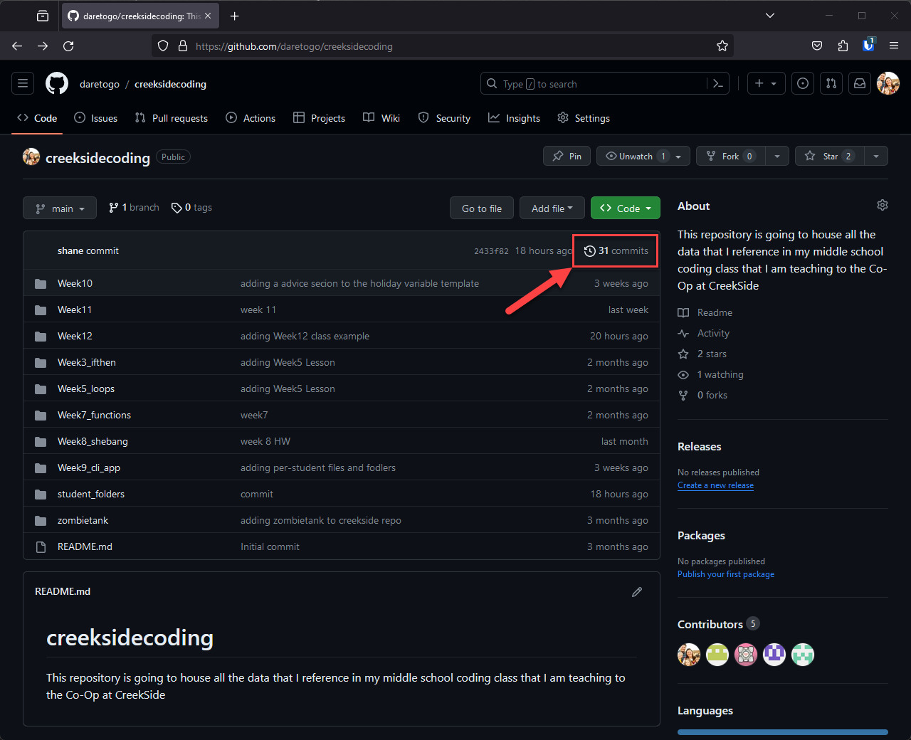

# Week 12 Homework

## Class Review
Great work in class this week guys, I am so proud of you all making your very first commits to our creekside coding github repo. 

Let's go to the github.com website and visit the creekside coding repo

[https://github.com/daretogo/creeksidecoding](https://github.com/daretogo/creeksidecoding) 

be sure that you are signed in (look in the upper right for a sign in button if needed). 

From that page you should see a message that shows the number of commits: 

When you click on that link, you'll be shown a "commit history" 