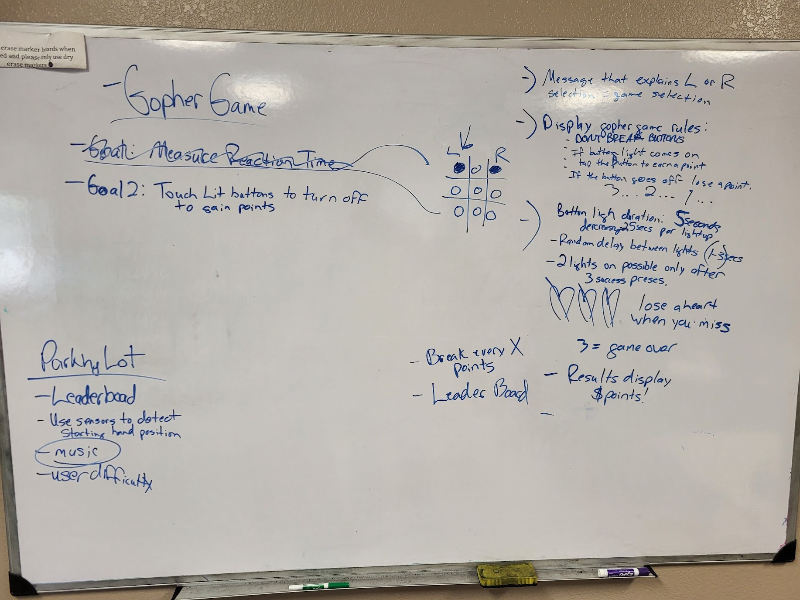
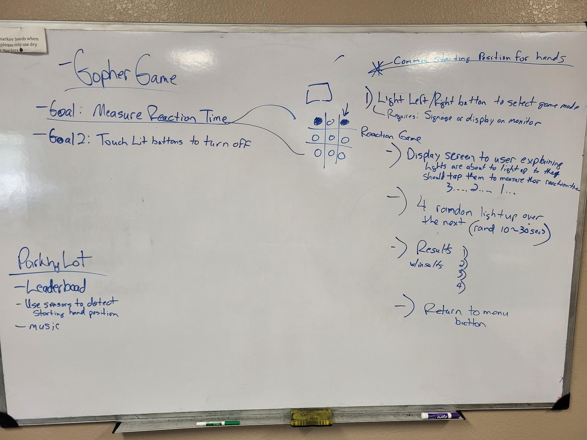

## Final Project Planning! 

Great work everybody on Wednesday in our final project planning session were we spent class discussing our ideas from last week for our final project games, and deep diving in to the requirements of each game. 

Here's our (messy) whiteboard notes from class if you want to review: 

## My re-summary

To the best of my recollection, this is what we decided: 

- We will make 2 games, but they're selectable and playable on the same setup. 
- Game1 is "Measure Reaction Time" 
    - The overall goal of this game is to measure the users reaction time delay between when a button lights up and when they press it.  
    - The game is intended to have a humorous element encouraging and discouring the user based on their reaction time. 
    The technical process of Game1: 
        - There will be a screen displaying a message that explains:  "To play the Reaction Time game press the "L" lit up button, to play the Gopher game press the "R" lit up button.  Also a notice to he user to please not pound the buttons. 
        - Presuming the user presses the "L" button, we proceed to the Reaction Time game instructions:  "Buttons will light up, press them as fast as you can and we'll measure you're reaction time!" 3...2...1...
        - A total of 4 buttons randomly light up.  One at a time, spaced out randomly between 1-4 seconds sequentially. The button led stays lit until the user presses it, measuring the time delay between the light going on and the button being pressed and storing that time. 
        - A game summary screen is shown to the user, with their reation time listed out for Button 1, Button 2, Button 3, Button 4, and then their average reaction time listed out as the focus which is of course an average of the reaction time from all 4. 
        - Return to the main menu allowing for game selection
- Game2 is "Gopher game" 
    - The overall goal of this game is to accumulate points. Point are accumulated by touching the buttons that light up to "hit the gopher".  But if you miss and the light goes off before you touch it, or if you touch an unlit button you lose points. 
    - The game is intended to become more difficult over time, and have a definite ending when the player runs out of lives - thereby limiting the score. 
        The technical process of GAme2: 
            - There will be a screen displaying a message that explains:  "To play the Reaction Time game press the "L" lit up button, to play the Gopher game press the "R" lit up button.  Also a notice to he user to please not pound the buttons. 
            - Presuming the user presses the "R" button, we proceed to the gopher game. Instructions:  "Buttons will light up, press them as fast as you can to earn ponts! Miss them and lose points!  Don't touch unlit buttons!" 3....2....1...
            - One button at a time will light up at a random interval between 1-4 seconds, with the duration of it being lit also being random between 1-3 seconds. 
                - If the user presses the button while it's still lit they get a point.  
                - If the user doesn't press it in time and the light goes off - they missed it and lose a "life".  
                - If the user presses a button that is not lit, they lose a life.  There should be a "cooldown" grace period if someone presses the button within 0.4 seconds of the light going off where they are not penalized. 

Other features we talked about in class that we liked the idea of were: 
- A high score leaderboard
- For gopher game a "life" system that shows 3 hearts to start with on screen and the hearts decrease for each lost point.  The game is over when all 3 hearts are lost. 
- Having music 
- using the ultrasonic distance sensors to monitor starting hand position to ensure fairness. 

